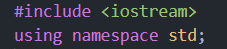
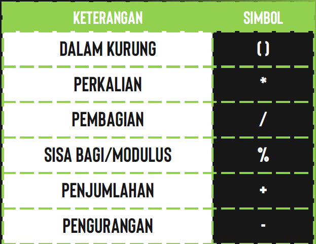
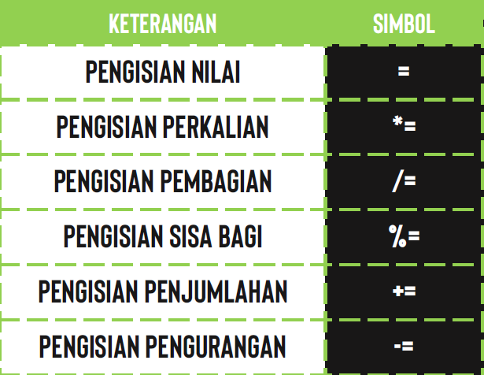
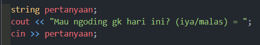
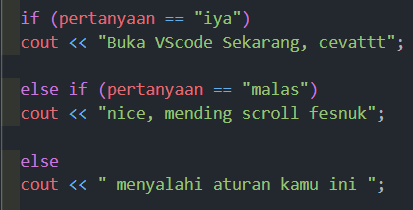
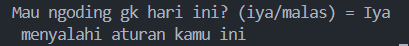
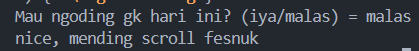
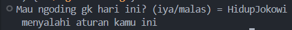
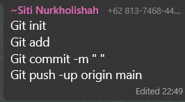

# Materi 1

Pada pertemuan pertama ini kami belajar tentang struktur dasar, tipe data, operator aritmatika dan operator penugasan yang ada di C++.

## Penjelasan

Struktur Data = Penjelasan mengenai library dan using namespace std;

Tipe data = Tipe data di bagi menjadi 3 jenis yaitu

- Primitif = int,float,char dan boolean
- Turunan = array, string, pointer dan function
- Buatan = Class dan struct

Operator aritmatika = Operasi hitungan yang ada di C++ 

Operator Penugasan = Jujur disini pahamnya cuma sama dengan ( = ) 

## Tugas

Tugas String
Pada Tugas String saya membuat program "Mau Ngoding Atau Engga". Di dalamnya seperti di materi saya menggunakna String dan ada Tambahan di luar Materi yaitu If else

Tugas int/float
Pada Tugas Int/float, saya membuat program "Bantu Bayar Utang", yang dimana saya menggunakan operasi aritmatika seperti yang ada pada materi

## DOKUMENTASI (ni bneer apa engga gtw)

#### Tugas String

1.  Meminta saran untuk ngoding atau tidak
2.  Diminta menginputkan pilihan
3.  Menampilkan saran dari pilihan

#### Cara Kerja

1.  Program menampilkan pertanyaan, user harus memilih jawaban yang telah ditentukan
    
2.  Program menampilkan saran berdasrkan jawaban yang dipilih
    

#### Output

1. 2. 3.

## Penutup

- Pada Materi ini, saya ada menggunakan bantaun AI dikit (beneran dikit kok), yaitu tentang penggunaan if else di C++, Bukan suruh bikin program loh ya
- Dikarenakan Kesalahan penulisan " Git push -up"  yang harusnya "Git push -u" membuat saya hampir scroll fesnuk, untungnya dah bisa jir
